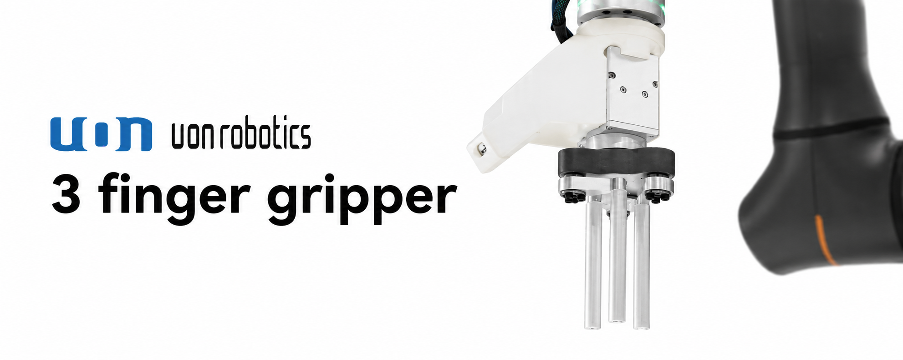
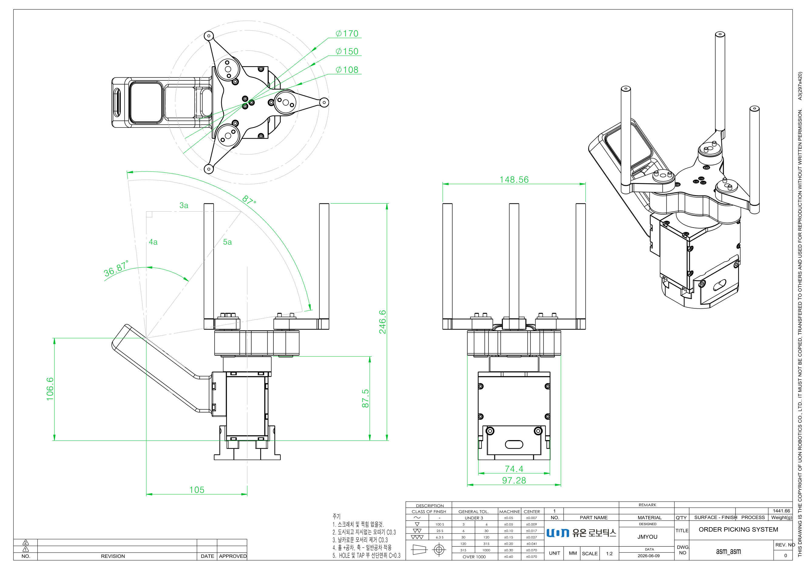
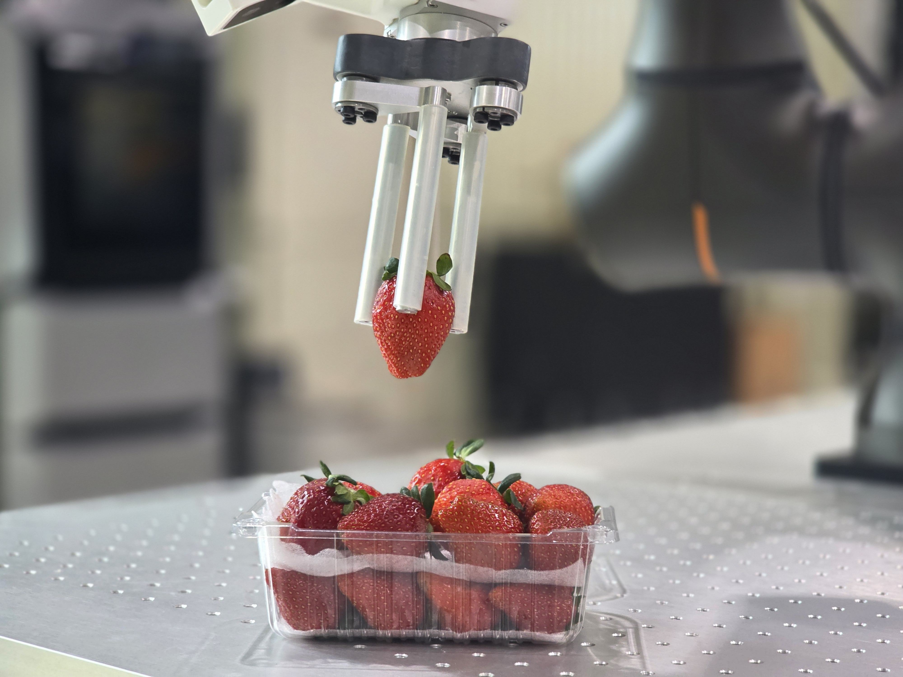
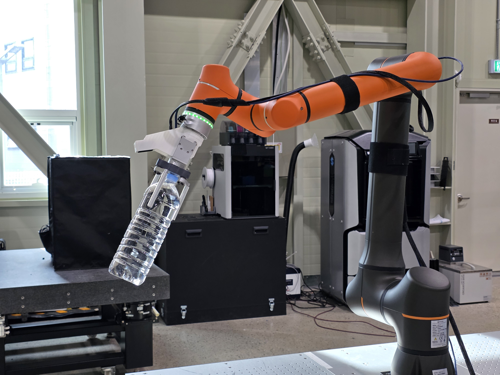
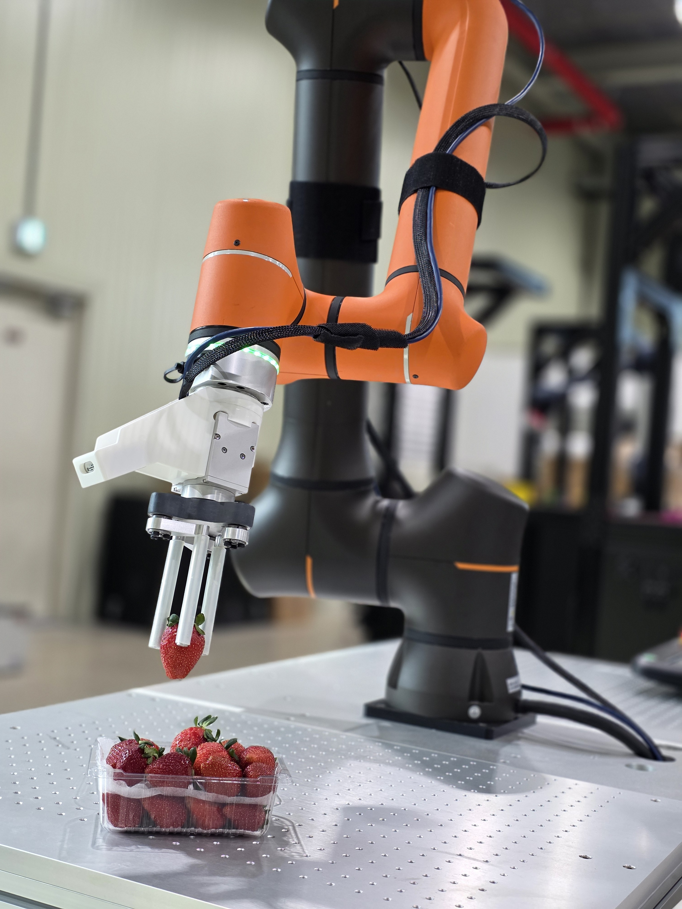
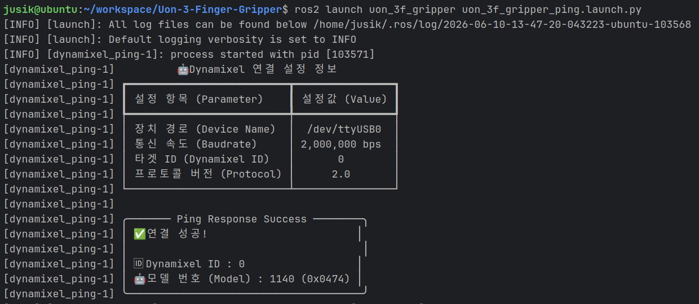

<!-- PROJECT LOGO -->
<br />
<div align="center">
  <a href="https://github.com/">
    
  </a>

<h1 align="center">UON ROBOTICS 3 Fingger Gripper</h1>
  <p align="center">
    ROS2 Library for 3-Finger Gripper Control
  </p>
</div>


<br />

## Features
- 
- 
- 
- 
- <video src="https://private-user-images.githubusercontent.com/49944621/605590380-07b1948e-2d28-418d-a890-adb302585b06.mp4?jwt=eyJ0eXAiOiJKV1QiLCJhbGciOiJIUzI1NiJ9.eyJpc3MiOiJnaXRodWIuY29tIiwiYXVkIjoicmF3LmdpdGh1YnVzZXJjb250ZW50LmNvbSIsImtleSI6ImtleTUiLCJleHAiOjE3ODEwNzU4NTUsIm5iZiI6MTc4MTA3NTU1NSwicGF0aCI6Ii80OTk0NDYyMS82MDU1OTAzODAtMDdiMTk0OGUtMmQyOC00MThkLWE4OTAtYWRiMzAyNTg1YjA2Lm1wND9YLUFtei1BbGdvcml0aG09QVdTNC1ITUFDLVNIQTI1NiZYLUFtei1DcmVkZW50aWFsPUFLSUFWQ09EWUxTQTUzUFFLNFpBJTJGMjAyNjA2MTAlMkZ1cy1lYXN0LTElMkZzMyUyRmF3czRfcmVxdWVzdCZYLUFtei1EYXRlPTIwMjYwNjEwVDA3MTIzNVomWC1BbXotRXhwaXJlcz0zMDAmWC1BbXotU2lnbmF0dXJlPWQyY2NlM2IzMmMyMDRjY2Y0MTE5MDE1ZGZlMWJmYmU3N2RlNjZmMmVhNWVjNzc2YWVhYzAwMjVhZmE2YTFiZjMmWC1BbXotU2lnbmVkSGVhZGVycz1ob3N0JnJlc3BvbnNlLWNvbnRlbnQtdHlwZT12aWRlbyUyRm1wNCJ9.wmV0DwbEKi1bb9Ol2bLTW9XBxP-4g24OSNlk1mvJHIs" autoplay loop muted playsinline width="100%"></video>
- <video src="https://github.com/user-attachments/assets/eddfbb0b-2732-4cf6-bdb4-88b0fac85b01" autoplay loop muted playsinline width="100%"></video>
- <video src="https://github.com/user-attachments/assets/97110521-e818-485e-83ae-95834ed92d9c" autoplay loop muted playsinline width="100%"></video>


<br />

## Installation

> [!NOTE]
> ROS2가 설치되어 있어야 합니다.

> [!NOTE]
> ROS2 없이 사용하려면 standalone 브렌치를 사용해주세요.

> [!IMPORTANT]
> USB 권한 설정을 반드시 해야합니다. 터미널에 다음 명령어를 입력 후 재부팅을 해주세요.\
> `sudo usermod -aG dialout $USER` \
> `sudo chmod 666 /dev/ttyUSB0`


### Dependencies

1. 제어에 필요한 패키지 들을 설치합니다 (DynamixelSDK, Serial..)
    ```shell
    sudo rosdep init
    rosdep update
    rosdep install --from-paths src --ignore-src -r -y
    ```

### Build

2. ros2 패키지를 빌드합니다
    ```shell
    colcon build --packages-select uon_3f_gripper
    source install/setup.bash
    ```

<br />

## Quick Start

### Ping

> [!NOTE]
> 그리퍼의 상태를 확인합니다.

```shell
ros2 launch uon_3f_gripper uon_3f_gripper_ping.launch.py 

# or

ros2 launch uon_3f_gripper uon_3f_gripper_ping.launch.py dxl_id:=0 device_name:=/dev/ttyUSB0 baudrate:=2000000
```

|핑 실행 예시|
|:-------------------------------------:|
|  |


### Demo
> [!NOTE]
> 그리퍼가 열렸다가 닫혀지는 데모를 실행합니다.

```shell
# 데모 실행
ros2 launch uon_3f_gripper uon_3f_gripper_demo.launch.py 
```

|               데모 실행 예시                |
|:-------------------------------------:|
|  |

<br />

## Usage

> [!NOTE]
> 토픽을 이용해 그리퍼를 제어하는 노드를 실행합니다.

> [!TIP]
> 토픽 이름 변경이 필요한 경우 config 디렉토리의 [gripper_config.yaml](src/uon_3f_gripper/config/gripper_config.yaml)의 내용을 수정하세요.

> [!TIP]
> 그리퍼의 힘을 조절하려면 max_effort값을 조절하세요.
> max_effort값이 높을 수록 힘과 반응성이 높아 집니다. 반대로 작을 수록 반응성은 낮아지지만 딸기 같은 물체를 손상 없이 집을 수 있습니다.


1. 그리퍼 노드를 실행합니다
    ```shell
    # 그리퍼 노드 실행
    ros2 launch uon_3f_gripper uon_3f_gripper_node.launch.py 
    ```

2. 다른 터미널에서 아래 명령어를 입력해 토픽을 보냅니다
    ```shell
    # 토픽 명령 실행 (닫음)
    ros2 topic pub --once /uon/gripper_3f/command control_msgs/msg/GripperCommand "{position: 0.0, max_effort: 50.0}"
    
    # 토픽 명령 실행 (열음)
    ros2 topic pub --once /uon/gripper_3f/command control_msgs/msg/GripperCommand "{position: 1800.0, max_effort: 50.0}"
    ```


|               토픽 명령 예시                |
|:-------------------------------------:|
|  |


<br />

> [!TIP]
> GUI를 이용해 그리퍼를 제어하는 예제도 있습니다!

```shell
# gui 실행
ros2 launch uon_3f_gripper uon_3f_gripper_ui.launch.py 
```

|               GUI 실행 예시               |
|:-------------------------------------:|
|  |


<br />

## Troubleshooting

- 